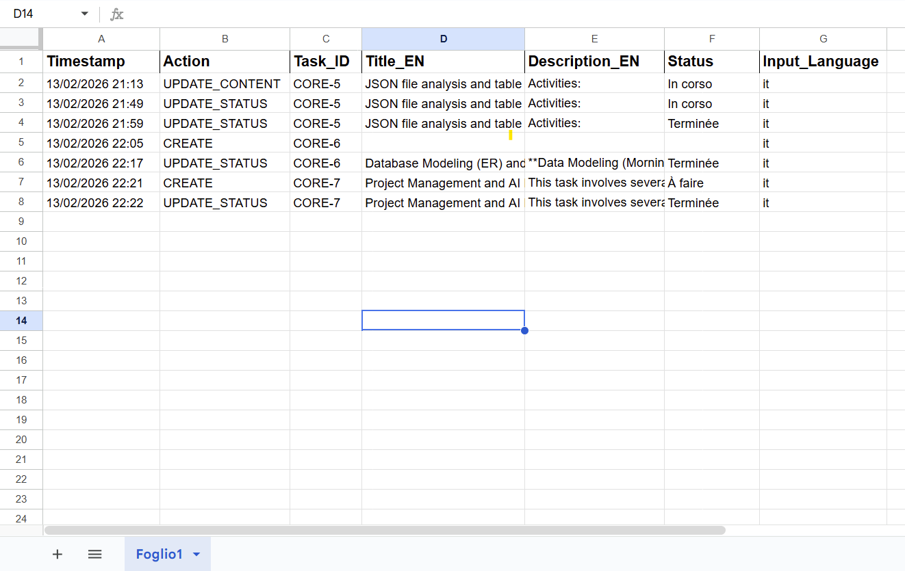

# AI Jira Project Manager v2: AI | Telegram Bot | n8n

## Motivation
This project was developed as a personal initiative to solve a practical workplace challenge. I designed and built this tool to optimize my daily workflow, simplify task entry, and improve overall productivity. It demonstrates how AI-driven automation can transform personal organization into a structured, professional process.

## Overview
This advanced automation framework transforms a standard Telegram Bot into an intelligent Project Management Assistant. By leveraging **n8n** as the orchestration engine and **Gemini AI** as the Natural Language Interpreter, the workflow allows users to manage Jira tasks through natural conversation in **Italian, French, German, or English**. The AI automatically detects the input language, interprets the user's intent, and executes structured commands — translating all Jira fields into professional technical English.

## Workflow Schema

## Demo

> **[▶ Click here to watch the demo video](JiraBotRecorder.mp4)**
> The video shows the bot in action: creating a task and retrieving the task list — all through natural language in Telegram.

## Activity Log (Google Sheets)

> *Every action is automatically logged to Google Sheets with timestamp, action type, task ID, title, description, status, and detected language.*

## What's New in v2
* **Multilingual Support**: The AI now accepts commands in Italian, French, German, and English (v1 was Italian only).
* **Update Issue Content**: New `UPDATE_CONTENT` action allows modifying an existing issue's title and/or description.
* **Smart Clarification**: When a command is ambiguous or incomplete, the AI responds with a `CLARIFY` action, asking the user for more details instead of failing silently.
* **Real-time Webhook Trigger**: Replaced the scheduled polling mechanism with a Telegram Webhook for instant response times.
* **Dynamic Jira Transitions**: Automatically resolves multi-step status transitions (e.g., *To Do → Done* is handled as *To Do → In Progress → Done*).
* **Auto-Assignment**: Newly created issues are automatically assigned to the authenticated user.
* **Typing Indicator**: The bot sends a "typing..." chat action while processing, providing a natural conversational experience.
* **Formatted Task Dashboard**: The `LIST` command now returns a clean, MarkdownV2-formatted task overview.
* **Robust AI Output Parser**: A dedicated Code node validates and normalizes every AI response before routing.

## Key Features
* **Conversational Task Management**: Create, update content, change status, and list Jira tasks using natural language.
* **Intelligent NLP Translation**: Automatically converts multilingual user input into professional technical English for Jira fields (Summary and Description).
* **Intent Detection & Routing**: A 5-way Switch router directs parsed AI output to the correct action: `CREATE`, `UPDATE_STATUS`, `UPDATE_CONTENT`, `LIST`, or `CLARIFY`.
* **Real-time Feedback Loop**: Provides immediate confirmation messages via Telegram after every operation.
* **Activity Logging**: Every operation is synchronized in real-time with **Google Sheets** for auditing and historical reporting.
* **Error Resilience**: Critical nodes use `continueOnFail` to prevent the entire workflow from breaking on a single error.

## Usage Guide
Once the workflow is active, simply send a message to your Telegram Bot in natural language. The AI will detect your intent automatically — no special prefixes required.

### Supported Actions

| Action | What to say | Example |
|---|---|---|
| **Create a Task** | Describe the task you need | *"Prepara la documentazione per lo stage"* |
| **Update Status** | Mention the issue key and new status | *"Metti CORE-123 in corso"* |
| **Update Content** | Mention the issue key and the new title/description | *"Cambia il titolo di CORE-45 in Review API endpoints"* |
| **List Tasks** | Ask for a task list | *"Mostrami i miei task"* |

> **Supported languages**: Italian, French, German, English.
> **Supported statuses**: *To Do*, *In Progress*, *Done* (the AI normalizes any variation).

## Technical Architecture
1. **Trigger**: A Telegram Webhook receives messages in real-time.
2. **Filtering**: A filter node validates that the incoming update contains message text.
3. **UX Feedback**: A "typing..." chat action is sent to indicate the bot is processing.
4. **AI Reasoning**: An AI Agent (Gemini) interprets intent, detects language, and translates content into structured JSON.
5. **Parsing & Validation**: A Code node parses and validates the AI output, normalizing actions and fields.
6. **Routing**: A 5-way Switch node directs the payload to the appropriate execution branch (`CREATE`, `UPDATE_STATUS`, `UPDATE_CONTENT`, `LIST`, `CLARIFY`).
7. **Jira Execution**: The relevant Jira API action is performed (create issue, transition status, update fields, or fetch tasks).
8. **Smart Transitions**: For status changes, available transitions are fetched dynamically; multi-step transitions are resolved and executed automatically.
9. **Auto-Assignment**: Created issues are automatically assigned to the user via the Jira API.
10. **Feedback**: A formatted confirmation message is sent back to the user via Telegram.
11. **Persistence**: Every action is logged to Google Sheets with timestamp, action type, task ID, and language metadata.

## Prerequisites
* An active **n8n** instance (self-hosted or cloud).
* A **Telegram Bot** token (via [@BotFather](https://t.me/BotFather)).
* A **Jira Cloud** account with API access.
* A **Google Cloud** service account with Google Sheets API enabled.
* A **Google Gemini API Key**.

## License
This project is licensed under the MIT License - see the [LICENSE](LICENSE) file for details.

---
*Developed as a personal productivity tool for professional workflow optimization.*
